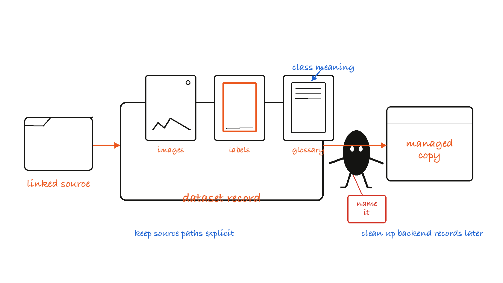
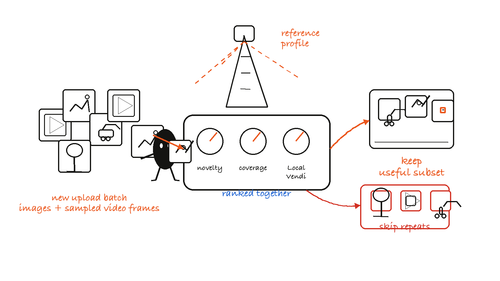
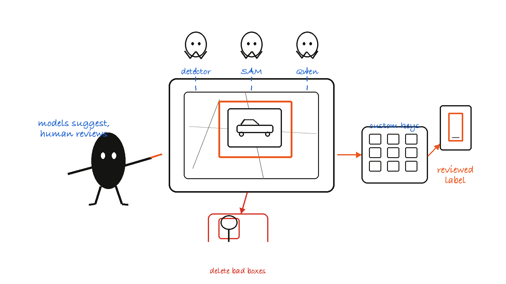
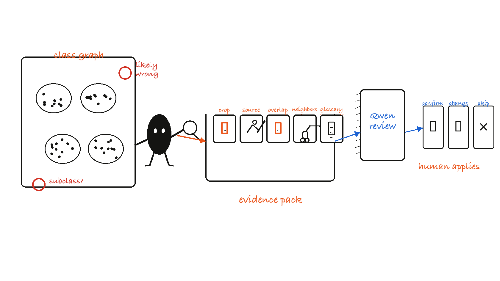
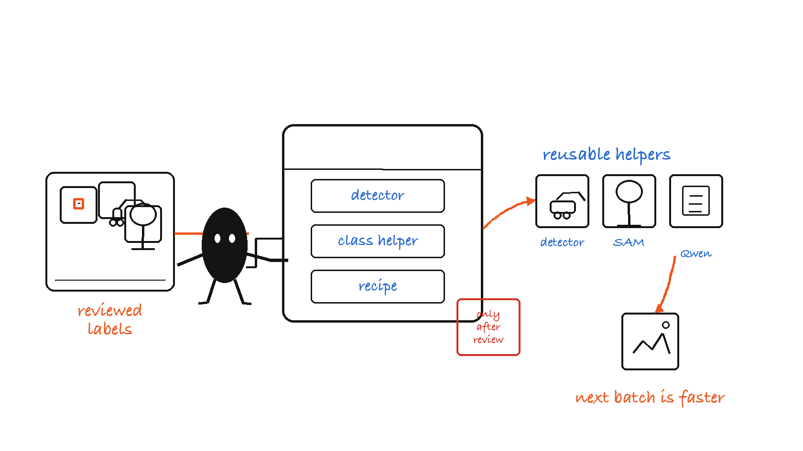

# Tator

Tator is a local annotation-assistance workbench for object-detection datasets.
Its main job is to help you **extend an existing trusted dataset** with new
images or videos while doing less manual drawing, less blind review, and fewer
repetitive cleanup passes.

The product loop is deliberately human-controlled:

1. Start from a dataset you already trust.
2. Pick only the new media worth annotating.
3. Let local models draft boxes, classes, captions, and review evidence.
4. Correct labels in the annotation view.
5. Audit the expanded dataset for likely mistakes and hidden subclasses.
6. Train or reuse helpers so the next batch is faster.

Models help with ranking, proposals, visual reasoning, and repeatable recipes.
Final annotation changes stay under the user's control unless an explicit
automation mode is enabled.


## Quick Start

Install the local environment once:

```bash
poetry install --only-root
poetry run tator-setup macos
```

Start the backend from the repository root:

```bash
tools/run_macos_backend.sh
```

Open the browser UI:

```text
http://127.0.0.1:8000/
```

The backend serves the UI at `/` and `/tator.html`. The old `/ybat.html` URL
redirects to `/tator.html`.

If port `8000` is already in use:

```bash
PORT=8080 tools/run_macos_backend.sh
```

From another directory:

```bash
cd /path/to/Tator && tools/run_macos_backend.sh
```

For setup details, see [Environment Setup](docs/environment_setup.md) and
[macOS Inference Setup](docs/macos_inference_setup.md).

## What Tator Is For

Use Tator when you have an annotation project where a fully manual workflow is
too slow, but blind automation is too risky.

The strongest use case is dataset extension:

| Problem | Tator's role |
| --- | --- |
| You have a good accepted dataset and new media to add. | Score the new media before labeling so effort goes to the useful subset. |
| New videos contain many similar frames. | Sample frames, rank the whole upload together, and skip repeats. |
| Drawing every object from scratch is slow. | Use detectors, SAM/SAM3, class predictors, and Qwen as draft helpers. |
| Existing labels may contain mistakes. | Use Class Split Explorer to surface outliers, overlaps, likely wrong classes, and subclass islands. |
| The next batch should get easier. | Train reusable helpers from reviewed labels and keep project-specific recipes. |

Tator is not a one-click dataset factory. It is a local review loop that makes
the human's work smaller, better structured, and easier to audit.

## The Main Workflow

For a first dataset-extension run, use the UI in this order:

| Step | UI area | Result |
| --- | --- | --- |
| 1 | Dataset Management | The accepted dataset, labels, label map, glossary, and storage state are explicit. |
| 2 | Data Ingestion | New images and sampled video frames are ranked; low-value media can be skipped. |
| 3 | Label Images | Model suggestions are reviewed and corrected in the live annotation workspace. |
| 4 | Class Split Explorer | Likely wrong labels, overlapping boxes, outliers, and subclass structure are inspected. |
| 5 | Training and Recipes | Reviewed labels become reusable detectors, class helpers, SAM/SAM3 assets, or recipes. |
| 6 | Runtime and Model Controls | Local models, devices, and inference/training paths are selected and debugged. |

The tabs are numerous because the app covers the whole local annotation loop.
Think of them as six tool groups rather than unrelated features.

## 1. Dataset Foundation

Dataset Management is where an annotation project becomes concrete. A useful
dataset record is not just a folder of images; it also needs labels, class
order, class definitions, storage state, and export rules.



Use Dataset Management to:

- open or upload a dataset,
- register local source files without copying them,
- name backend-managed datasets so temporary records can be recognized later,
- inspect label maps and class order,
- maintain class glossary text for ambiguous cases,
- export reviewed data.

Two storage modes matter:

| Mode | Meaning | Use it when |
| --- | --- | --- |
| Linked dataset | Tator stores metadata and overlays while source files stay where they are. | You want to keep the original image folder in place. |
| Managed dataset | Tator owns a backend copy of images and labels. | You want the backend to reopen, train on, export, or delete that dataset record independently. |

Deleting a linked dataset record does not delete original source images.
Deleting a managed dataset acts on the backend-managed record, so important
datasets and artifacts should still be backed up outside the workbench.

## 2. Data Ingestion

Data Ingestion answers the question: **which new media is worth adding before
anyone spends time labeling it?**



The flow is:

1. Choose the trusted reference dataset.
2. Build, select, upload, or download its reference profile.
3. Upload candidate images and videos.
4. Let Tator pool the whole current upload together.
5. Rank candidates by reference novelty, within-upload coverage, and optional
   Local Vendi patch diversity.
6. Keep or discard candidates from previews.
7. Export the accepted candidate set as a ZIP for annotation or dataset
   extension.

Important behavior:

- Multiple images and videos are scored as one upload batch.
- "Keep the top 20%" means the top 20% of the whole current upload, not 20% of
  each video.
- Videos are sampled into frames before scoring.
- Reference profiles can be downloaded and reused later.
- Ingestion decides what is worth labeling. It does not decide whether labels
  are correct.

## 3. Assisted Annotation

Label Images is the live annotation workspace. This is where labels are drawn,
edited, reviewed, and saved.



Inside the annotation view you can:

- draw, move, resize, reclassify, and delete boxes,
- switch images and classes,
- customize keyboard shortcuts for normal keyboards or programmable keypads,
- run detector proposals for first-pass boxes,
- use SAM/SAM3 prompts for interactive object help,
- use class predictors for class hints,
- use Qwen for captions, context, and visual reasoning support,
- export reviewed labels.

The important rule is simple: models suggest, the user reviews, and only
reviewed labels become trusted labels.

## 4. Class Quality Audit

Class Split Explorer answers the question: **which labels in this dataset look
suspicious or internally inconsistent?**



It embeds object crops, projects them into a graph, and helps review objects
that do not fit cleanly with their assigned class.

Use it for:

- all-class sanity checks,
- selected-class subclass exploration,
- PCA and UMAP projections for different inspection goals,
- likely-wrong vignettes with confirm, skip, reassign, and see-instance actions,
- source-image jumps so a box can be fixed in context,
- optional Qwen review using crop evidence, source-image context, overlap
  evidence, similar examples, same-image context, glossary text, and
  deterministic audit checks.

For Qwen review, the local VLM is the core reviewer. Overlap, scale, embedding,
quality, and cue checks are rails and evidence; they are not a replacement for
visual reasoning. The human applies the final annotation change.

Detailed design and benchmark notes are in
[Class Split Qwen Review Agent](docs/class_split_qwen_review_agent.md) and
[Class Split Qwen Review V1 Benchmark](docs/class_split_qwen_review_v1_benchmark.md).

## 5. Training And Reusable Helpers

Training is optional for manual annotation. It becomes valuable once labels have
been reviewed well enough to teach project-specific helpers.



Common paths:

| UI area | Use it for |
| --- | --- |
| Train Class Predictor | Train CLIP/DINOv3-style class heads for faster class suggestions. |
| Train YOLO / Train RF-DETR | Train detectors for box proposals and future prelabeling. |
| Train SAM3 | Build SAM3 datasets and promptable segmentation helpers. |
| Train Qwen 3 | Manage local VLM models and adapter-training paths. |
| EDR Builder / SAM3 Recipe Mining | Package repeatable prelabeling behavior. |
| SAM3 Vocabulary Explorer | Inspect and refine prompt vocabulary for reusable SAM3 workflows. |

Train the helper that removes the next real bottleneck. Do not train every
helper just because the tab exists.

## 6. Runtime And Model Controls

Tator supports multiple local runtimes because Apple Silicon inference, Linux
training, and pinned CUDA stacks have different dependency constraints.

Recommended setup commands:

```bash
# Apple Silicon inference and local MLX paths
poetry run tator-setup macos

# General Linux backend and training stack
poetry run tator-setup linux

# Pinned Falcon CUDA 11.8 stack
poetry run tator-setup falcon-cu118
```

Useful setup options:

```bash
poetry run tator-setup macos --dry-run
poetry run tator-setup linux --dev
poetry run tator-setup falcon-cu118 --venv-dir .venv-falcon
poetry run tator-setup macos --recreate
```

Optional macOS overrides can go in `.env.macos`:

```bash
QWEN_DEVICE=auto
QWEN_INFERENCE_PLATFORM=auto
QWEN_MLX_MODEL_NAME=mlx-community/Qwen3-VL-4B-Instruct-4bit
DINOV3_BACKEND=auto
```

See [macOS Inference Setup](docs/macos_inference_setup.md) for MLX-DINOv3,
MLX-SAM, Qwen MLX-VLM, and Apple Silicon fallback behavior.

## Data Safety Model

Tator is designed around local, human-controlled dataset work.

Safety principles:

- Label changes are advisory until the user accepts or applies them.
- The currently open annotation workspace is preserved as the live review state.
- Data Ingestion workspace uploads require names so temporary backend records
  can be identified and cleaned later.
- Linked dataset deletion does not delete original source images.
- Managed dataset deletion acts on the backend record, so important data should
  have external backups.
- Long-running uploads and jobs use sidecar metadata so failed or cancelled jobs
  are observable instead of disappearing silently.
- Qwen and Class Split review artifacts preserve raw model inputs, outputs, and
  guardrail evidence for auditability.

Related docs:

- [Dataset/Data Ingestion Safety Audit](docs/dataset_data_ingestion_safety_audit.md)
- [Backend Storage Hardening Log](docs/backend_storage_hardening_log.md)
- [Class Split, Data Ingestion, Dataset Flow Review](docs/class_split_ingestion_dataset_flow_review.md)

## Documentation Map

Use these docs when the README is not enough:

- [Environment Setup](docs/environment_setup.md)
- [macOS Inference Setup](docs/macos_inference_setup.md)
- [Agent Governance](docs/agent_governance.md)
- [Class Split Qwen Review Agent](docs/class_split_qwen_review_agent.md)
- [Class Split Qwen Review V1 Benchmark](docs/class_split_qwen_review_v1_benchmark.md)
- [Ensemble Detection Recipe Explainer](docs/ensemble_detection_recipe_explainer.md)
- [Dataset/Data Ingestion Safety Audit](docs/dataset_data_ingestion_safety_audit.md)
- [Flow Audit Matrix](docs/flow_audit_matrix.md)

<details>
<summary>Developer And API Map</summary>

Repository layout:

```text
Tator/
  app/                    FastAPI app export for uvicorn
  api/                    Route modules
  services/               Dataset, model, runtime, and training services
  tools/                  Setup, training, validation, and utility scripts
  ybat-master/            Browser UI served as tator.html
  docs/                   Design notes, setup docs, audits, benchmarks
  uploads/                Runtime datasets, caches, jobs, and model artifacts
```

Primary API groups:

- `/datasets/*`, `/glossaries/*`: dataset library, linked datasets, labels, and
  glossary state
- `/data_ingestion/*`: reference profiles, candidate scoring, accepted ZIPs
- `/class_analysis/*`: embedding jobs, plot data, likely-wrong review, mobile
  review, and Qwen evidence review
- `/qwen/*`: Qwen status, settings, model activation, captions, inference,
  prepass, dataset upload, and training
- `/sam3/*`, `/sam_point*`, `/sam_bbox*`: SAM/SAM3 prompts, datasets, models,
  training, and prompt helpers
- `/yolo/*`, `/rfdetr/*`: detector inference, activation, training, and registry
  flows
- `/prepass/*`, `/calibration/*`, `/agent_mining/*`: recipe, calibration, and
  automated labeling helpers
- `/runtime/*`, `/system/*`: runtime unload, health, and storage checks

Useful local tools:

- setup: `tools/setup_venv_macos_inference.sh`,
  `tools/setup_venv_falcon_cu118.sh`
- dataset utilities: `tools/reorder_labelmap.py`,
  `tools/reorder_dataset_by_labelmap.py`, `tools/subset_dataset.py`
- segmentation utilities: `tools/convert_yolo_to_yolo_seg.py`,
  `tools/build_sam3_dataset.py`
- validation helpers: `tools/check_storage_health.py`,
  `tools/validate_dataset_uploads.py`

See [tools/README.md](tools/README.md) for a shorter command index.

</details>

## Validation

Focused smoke tests:

```bash
.venv-macos/bin/python -m pytest tests/test_api_route_uniqueness.py tests/test_dataset_zip_upload_security.py -q
.venv-macos/bin/python -m pytest tests/test_labeling_panel_layout_contract.py tests/test_class_analysis.py -q
```

Broader validation references:

- [Flow Audit Matrix](docs/flow_audit_matrix.md)
- [GPU Validation Closure Report](docs/gpu_validation_closure_report.md)
- [Class Split Qwen Review V1 Benchmark](docs/class_split_qwen_review_v1_benchmark.md)

<details>
<summary>Recent Hardening Highlights</summary>

- Backend serves `/tator.html`; legacy `/ybat.html` redirects there.
- Data Ingestion workspace uploads require explicit dataset names before
  creating backend-backed datasets.
- Class Split likely-wrong review is centered on the live annotation workspace;
  mobile review sessions sync to that current workspace state.
- Keyboard shortcuts are configurable and the on-screen shortcut explainer reads
  from the active shortcut map.
- Class Split Qwen review preserves raw VLM inputs, outputs, and deterministic
  guardrail evidence for auditability.
- Data Ingestion ranks each current upload batch as one pooled set, including
  sampled frames from multiple videos.

</details>

## Licenses And Model Terms

This repo is local tooling. Check the license and acceptable-use terms for every
model, dataset, and generated artifact you use.

Notable external dependencies and model families include:

- Meta SAM / SAM3 checkpoints and dependencies
- Qwen/Qwen3-VL and compatible local VLM checkpoints
- Ultralytics YOLO
- RF-DETR
- CLIP, DINOv3, C-RADIO, and related embedding backbones
- MLX, MLX-VLM, and optional Apple Silicon model ports

License compliance for trained models and exported datasets remains the user's
responsibility.
