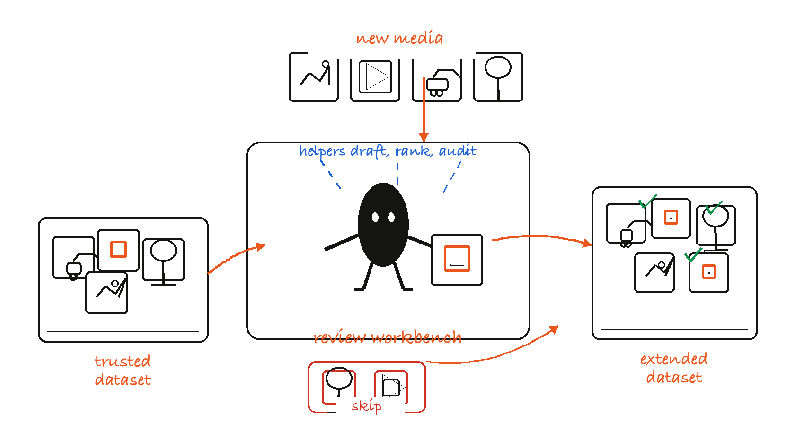
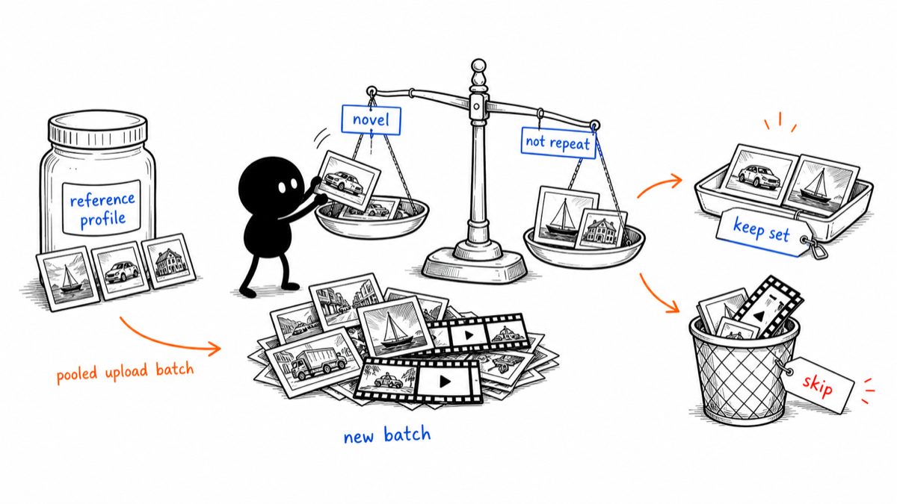
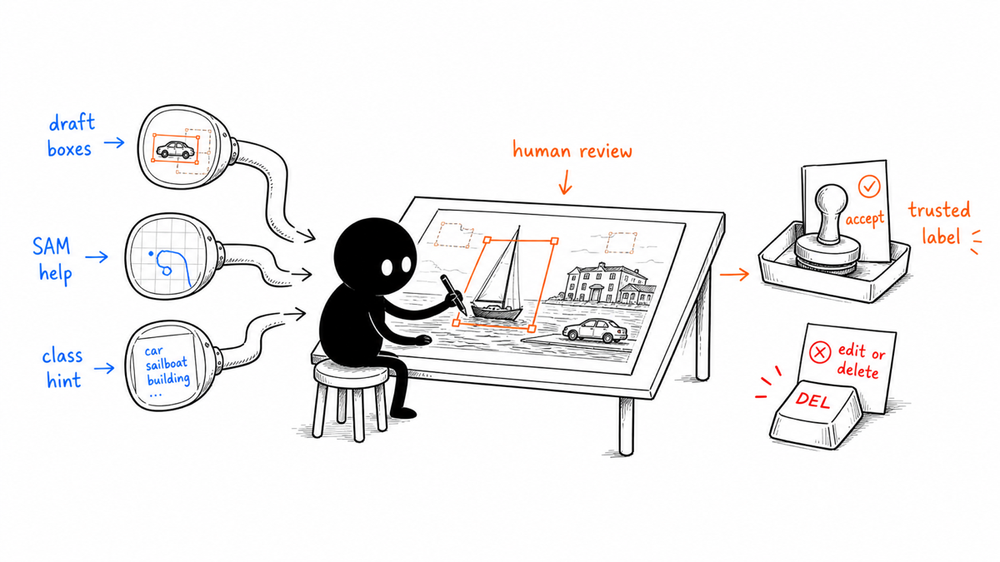
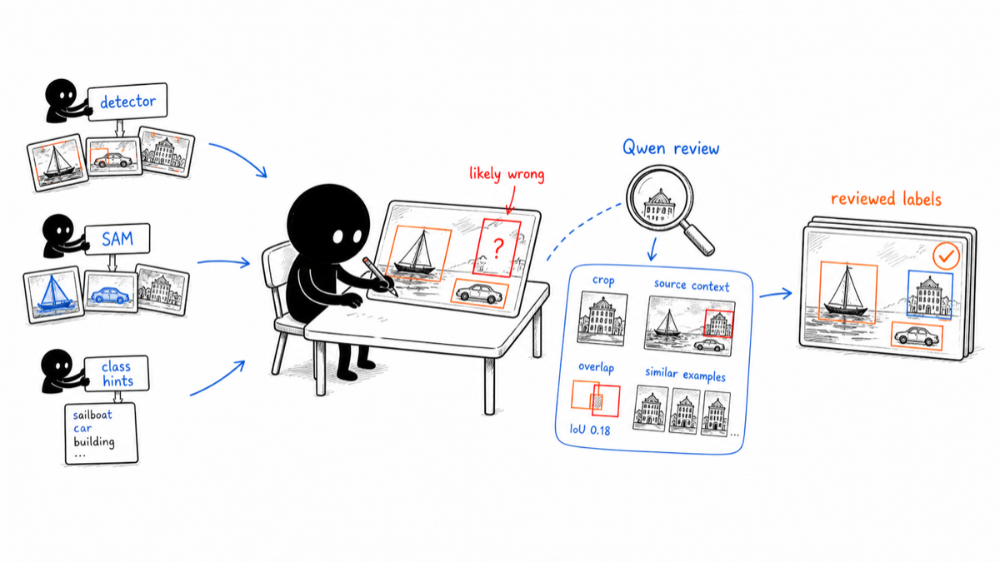
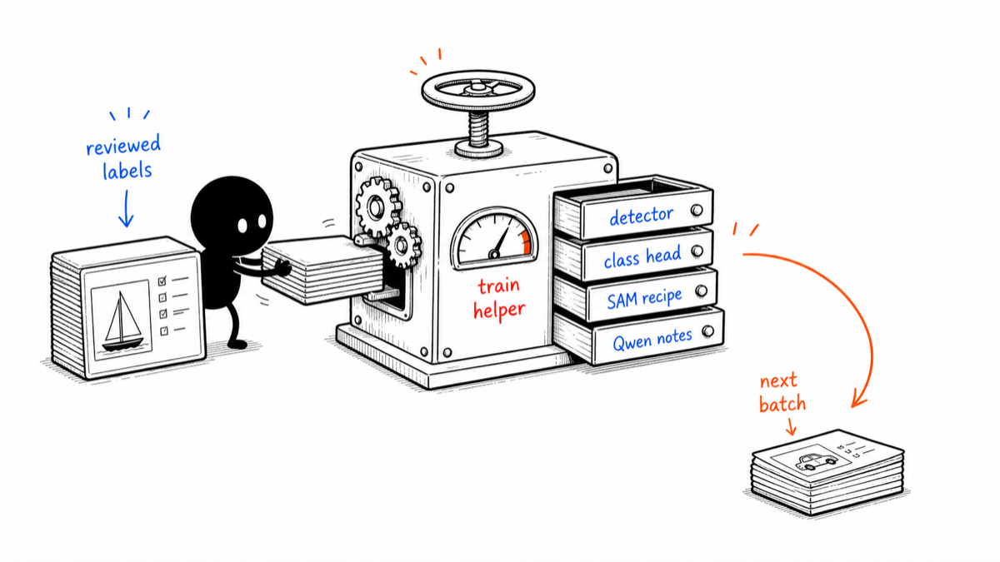

# Tator

Tator is a local annotation-assistance workbench for object-detection datasets.
Its main job is to help you **extend an existing trusted dataset with new images
or videos while doing less manual drawing, less blind review, and less repeated
cleanup**.

The product is not a one-click label factory. Tator uses local models to rank
new media, draft boxes, suggest classes, inspect suspicious labels, and train
reusable helpers. The human still decides what enters the dataset and which
annotation changes become trusted labels.



## Start Here

Install the local environment once:

```bash
poetry install --only-root
poetry run tator-setup macos
```
the second piece of the poetry setup contains a harcoded ref to python3.11:

python3.11 -m venv .../xxx/Tator/.venv-macos

if your Poetry setup picked a different version of python then run the venv
init with the correct version before the tator-setup step, ie:

python3.1xx -m venv .../xxx/Tator/.venv-macos


Then start the backend from the repository root with this single command:

```bash
tools/run_macos_backend.sh
```

If you are not already in the repo, use:

```bash
cd <your Tator checkout> && tools/run_macos_backend.sh
```

Leave that terminal running. When the backend is up, open:

```text
http://127.0.0.1:8000/
```

The backend serves the app at `/` and `/tator.html`. The old `/ybat.html` URL
redirects to `/tator.html`.

If port `8000` is already in use:

```bash
PORT=8080 tools/run_macos_backend.sh
```

Quick health check from a second terminal:

```bash
curl http://127.0.0.1:8000/system/health_summary
```

For setup details, see [Environment Setup](docs/environment_setup.md) and
[macOS Inference Setup](docs/macos_inference_setup.md).

## What Tator Is For

Use Tator when a manual annotation loop is too slow, but blind automation is too
risky.

The strongest use case is dataset extension:

| You have... | Tator helps you... |
| --- | --- |
| A trusted accepted dataset | Keep its label map, glossary, storage state, and exports explicit. |
| New images or videos | Score the whole upload batch and keep the media most worth annotating. |
| Lots of boxes to draw | Use detectors, SAM/SAM3, class heads, and Qwen as draft assistants. |
| Existing labels that may be wrong | Find likely-wrong classes, overlap conflicts, outliers, and subclass islands. |
| A project you will repeat | Train reusable helpers and recipes from reviewed labels. |

Everything is organized around reducing human effort while preserving human
control.

## The Dataset-Extension Loop

For a normal project pass, work through the UI in this order:

| Step | Goal | Main UI area |
| --- | --- | --- |
| 1 | Define the trusted dataset, labels, glossary, storage mode, and export state. | Dataset Management |
| 2 | Decide which new media is worth labeling before drawing boxes. | Data Ingestion |
| 3 | Draft, edit, reclassify, delete, and confirm boxes in the live workspace. | Label Images |
| 4 | Audit the expanded dataset for likely mistakes and hidden subclasses. | Class Split Explorer |
| 5 | Train helpers so the next batch starts with better proposals. | Training and recipe tabs |
| 6 | Select local models, devices, and runtime paths. | Model/runtime settings tabs |

The top navigation has many tabs because Tator covers the whole local annotation
assist loop. Think of the tabs as five core tool groups plus runtime controls,
not as unrelated features.

## Core Tool Groups

### 1. Dataset Foundation

Dataset Management is the project control point. Use it before and after the
model-assisted work so the dataset's identity and safety state are explicit.

It handles:

- opening, uploading, linking, naming, and deleting dataset records,
- label-map order and class names,
- class glossary text for ambiguous labels,
- backend-managed dataset records,
- reviewed-data exports,
- cleanup of temporary backend records.

Two storage modes matter:

| Mode | Meaning | Best for |
| --- | --- | --- |
| Linked dataset | Tator stores metadata and overlays while source files stay where they are. | Working from an existing local image folder without copying it. |
| Managed dataset | Tator owns a backend copy of images and labels. | Reopening, training on, exporting, or deleting a named backend record. |

Deleting a linked dataset record does not delete the original source images.
Deleting a managed dataset acts on the backend-managed record, so important
datasets should still be backed up outside Tator.

### 2. Data Ingestion

Data Ingestion answers the first dataset-extension question:
**which new media is worth adding to the trusted dataset?**



The flow is:

1. Choose the accepted reference dataset.
2. Build or select its reference profile.
3. Upload candidate images and videos.
4. Let Tator pool the whole current upload together.
5. Rank candidates by reference novelty, within-upload coverage, and optional
   Local Vendi patch diversity.
6. Keep or discard candidates from previews.
7. Export the accepted candidate set as a ZIP or continue into annotation.

Important behavior:

- Multiple images and multiple videos are scored as one current upload batch.
- "Keep the top 20%" means the top 20% of that pooled batch, not 20% of each
  file.
- Videos are sampled into frames before scoring.
- Reference profiles can be downloaded, uploaded, and reused for later batches.
- Ingestion ranks media value. It does not certify annotation correctness.

### 3. Assisted Annotation

Label Images is the live annotation workspace. This is where boxes are drawn,
edited, reclassified, deleted, and saved.



Tator can help with:

- detector proposals for first-pass boxes,
- SAM/SAM3 prompts for interactive object help,
- class predictors for class suggestions,
- Qwen captions and visual context,
- configurable keyboard shortcuts for normal keyboards and programmable
  keypads,
- reviewed-label exports.

The rule is intentionally simple: **models propose, the user reviews, and only
reviewed labels become trusted labels**.

### 4. Quality Audit And Repair

Class Split Explorer audits labels that already exist. It embeds object crops,
projects them into 2D plots, and finds objects that are outliers, overlap
suspiciously, or appear to belong to a hidden subclass.



Use it to:

- inspect all-class structure,
- inspect one class for possible subclasses,
- switch between projection modes for different review goals,
- review likely-wrong vignettes,
- confirm the current class, skip a case, reassign a class, or jump back to the
  source image,
- ask Qwen to review a suspicious object with crop, source-context, overlap,
  similar-example, glossary, scale, embedding, and cue evidence.

For Qwen review, the local VLM's final judgment is the core product behavior.
Deterministic checks such as overlap, edge clipping, scale, embedding distance,
and cue verification are guardrails and audit evidence. They may block automatic
mutation, but they do not replace visual reasoning.

Detailed design and benchmark notes live in
[Class Split Qwen Review Agent](docs/class_split_qwen_review_agent.md) and
[Class Split Qwen Review V1 Benchmark](docs/class_split_qwen_review_v1_benchmark.md).

### 5. Reusable Helpers And Training

Training is optional during early manual review. It becomes useful once a
project has enough reviewed labels to teach repeatable helpers.



Common helper paths:

| UI area | What it helps with |
| --- | --- |
| Train Class Predictor | Faster class suggestions from project-specific class heads. |
| Train YOLO / Train RF-DETR | Detector proposals and future prelabeling. |
| Train SAM3 | Promptable segmentation helpers and SAM3 datasets. |
| Train Qwen 3 | Local VLM model management and adapter-training paths. |
| Detection Recipes / SAM3 Recipe Mining | Repeatable prelabeling recipes. |
| SAM3 Vocabulary Explorer | Prompt vocabulary and class-language inspection. |

Train the helper that removes the next real bottleneck. You do not need to use
every training tab on every project.

## Runtime And Model Controls

Tator supports multiple local runtimes because macOS inference, Linux training,
and CUDA training have different dependency constraints.

Recommended setup commands:

```bash
# Apple Silicon inference and local MLX paths
poetry run tator-setup macos

# General Linux backend and training stack
poetry run tator-setup linux

# Pinned Falcon CUDA 11.8 stack
poetry run tator-setup falcon-cu118
```

Useful setup options:

```bash
poetry run tator-setup macos --dry-run
poetry run tator-setup linux --dev
poetry run tator-setup falcon-cu118 --venv-dir .venv-falcon
poetry run tator-setup macos --recreate
```

Optional macOS overrides can go in `.env.macos`:

```bash
QWEN_DEVICE=auto
QWEN_INFERENCE_PLATFORM=auto
QWEN_MLX_MODEL_NAME=mlx-community/Qwen3-VL-4B-Instruct-4bit
TATOR_QWEN_PROGRESS_STALE_SECONDS=1800
DINOV3_BACKEND=auto
```

See [macOS Inference Setup](docs/macos_inference_setup.md) for MLX-DINOv3,
MLX-SAM, Qwen MLX-VLM, and Apple Silicon fallback behavior.
`TATOR_QWEN_PROGRESS_STALE_SECONDS` controls how long an active Qwen/prepass
progress record may sit without a heartbeat before the backend releases the UI
state and reports it as stale. The default is 30 minutes.

## Data Safety Model

Tator is designed around local, human-controlled dataset work:

- The currently open annotation workspace is the live review state.
- Label changes are advisory until the user accepts or applies them.
- Data Ingestion workspace uploads require names so temporary backend records
  can be recognized and cleaned later.
- Linked dataset deletion does not delete original source images.
- Managed dataset deletion acts on the backend-managed record.
- Long-running uploads and jobs use observable metadata rather than disappearing
  silently.
- Class Split and Qwen review artifacts preserve raw model inputs, outputs, and
  guardrail evidence for auditability.

Related docs:

- [Dataset/Data Ingestion Safety Audit](docs/dataset_data_ingestion_safety_audit.md)
- [Backend Storage Hardening Log](docs/backend_storage_hardening_log.md)
- [Class Split, Data Ingestion, Dataset Flow Review](docs/class_split_ingestion_dataset_flow_review.md)

## Documentation Map

Use these docs when the README is not enough:

- [Environment Setup](docs/environment_setup.md)
- [macOS Inference Setup](docs/macos_inference_setup.md)
- [Agent Governance](docs/agent_governance.md)
- [Class Split Qwen Review Agent](docs/class_split_qwen_review_agent.md)
- [Class Split Qwen Review V1 Benchmark](docs/class_split_qwen_review_v1_benchmark.md)
- [Ensemble Detection Recipe Explainer](docs/ensemble_detection_recipe_explainer.md)
- [Dataset/Data Ingestion Safety Audit](docs/dataset_data_ingestion_safety_audit.md)
- [Flow Audit Matrix](docs/flow_audit_matrix.md)
- [Tools Command Index](tools/README.md)

<details>
<summary>Developer And API Map</summary>

Repository layout:

```text
Tator/
  app/                    FastAPI app export for uvicorn
  api/                    Route modules
  services/               Dataset, model, runtime, and training services
  tools/                  Setup, training, validation, and utility scripts
  ybat-master/            Browser UI served as tator.html
  docs/                   Design notes, setup docs, audits, benchmarks
  uploads/                Runtime datasets, caches, jobs, and model artifacts
```

Primary API groups:

- `/datasets/*`, `/glossaries/*`: dataset library, linked datasets, labels, and
  glossary state
- `/data_ingestion/*`: reference profiles, candidate scoring, accepted ZIPs
- `/class_analysis/*`: embedding jobs, plot data, likely-wrong review, mobile
  review, and Qwen evidence review
- `/qwen/*`: Qwen status, settings, model activation, captions, inference,
  prepass, cancellation/progress lifecycle, dataset upload, and training
- `/sam3/*`, `/sam_point*`, `/sam_bbox*`: SAM/SAM3 prompts, datasets, models,
  training, and prompt helpers
- `/yolo/*`, `/rfdetr/*`: detector inference, activation, training, and registry
  flows
- `/prepass/*`, `/calibration/*`, `/agent_mining/*`: recipe, calibration, and
  automated labeling helpers
- `/runtime/*`, `/system/*`: runtime unload, health, and storage checks

Useful local tools:

- setup: `tools/setup_venv_macos_inference.sh`,
  `tools/setup_venv_falcon_cu118.sh`
- dataset utilities: `tools/reorder_labelmap.py`,
  `tools/detect_missclassifications.py`, `tools/label_candidates_iou90.py`
- Class Split/Qwen benchmarks:
  `tools/run_class_split_qwen_review_benchmark.py`,
  `tools/analyze_class_split_qwen_review_benchmark.py`
- validation helpers: `tools/run_refactor_validation.sh`,
  `tools/run_fuzz_fast.sh`, `tools/check_ui_endpoints.py`,
  `tools/run_ui_endpoint_method_check.py`, `tools/run_ui_contract_tests.py`,
  `tools/check_playwright_control_coverage.py`

See the [Tools Command Index](tools/README.md) for command examples.

</details>

<details>
<summary>Validation</summary>

Focused smoke tests:

```bash
.venv-macos/bin/python -m pytest tests/test_api_route_uniqueness.py tests/test_dataset_zip_upload_security.py -q
.venv-macos/bin/python -m pytest tests/test_labeling_panel_layout_contract.py tests/test_class_analysis.py -q
```

Hardening ladder for broader changes:

```bash
git diff --check
.venv-macos/bin/python -m pytest tests/test_validation_cleanup_tools.py -q
SKIP_GPU=1 BASE_URL=http://127.0.0.1:8000 tools/run_refactor_validation.sh
.venv-macos/bin/python tools/run_ui_endpoint_method_check.py http://127.0.0.1:8000
.venv-macos/bin/python tools/run_ui_contract_tests.py http://127.0.0.1:8000
.venv-macos/bin/python tools/check_playwright_control_coverage.py
RUN_UI_E2E=1 .venv-macos/bin/python -m pytest tests/ui/e2e -q
```

Broader validation references:

- [Flow Audit Matrix](docs/flow_audit_matrix.md)
- [GPU Validation Closure Report](docs/gpu_validation_closure_report.md)
- [Class Split Qwen Review V1 Benchmark](docs/class_split_qwen_review_v1_benchmark.md)

</details>

<details>
<summary>Update Tracking</summary>

- Backend serves `/tator.html`; legacy `/ybat.html` redirects there.
- Data Ingestion workspace uploads require explicit dataset names before
  creating backend-backed datasets.
- Class Split likely-wrong review is centered on the live annotation workspace;
  mobile review sessions sync to that current workspace state.
- Keyboard shortcuts are configurable and the on-screen shortcut explainer reads
  from the active shortcut map; direct class shortcuts are generated from the
  loaded labelmap instead of a fixed ID range.
- Class Split Qwen review preserves raw VLM inputs, outputs, and deterministic
  guardrail evidence for auditability.
- Data Ingestion ranks each current upload batch as one pooled set, including
  sampled frames from multiple videos.

</details>

## Licenses And Model Terms

This repo is local tooling. Check the license and acceptable-use terms for every
model, dataset, and generated artifact you use.

Notable external dependencies and model families include:

- Meta SAM / SAM3 checkpoints and dependencies
- Qwen/Qwen3-VL and compatible local VLM checkpoints
- Ultralytics YOLO
- RF-DETR
- CLIP, DINOv3, C-RADIO, and related embedding backbones
- MLX, MLX-VLM, and optional Apple Silicon model ports

License compliance for trained models and exported datasets remains the user's
responsibility.
